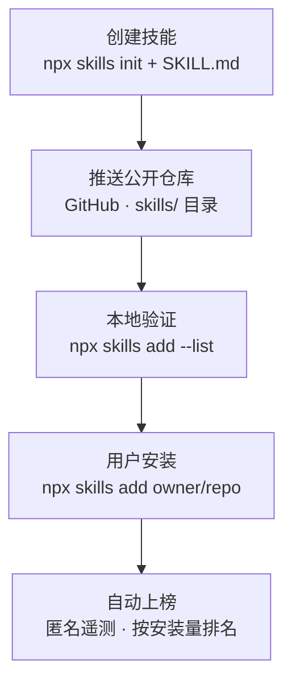

# skills.sh 发布技能指南

> 整理自 WorkBuddy 分享会话（2026-08-27），主题：上传技能流程 + 落地目录结构。

## 一句话结论

**skills.sh 不是"上传技能文件"的网站**（没有网页提交表单，`/submit` 返回 404）。它是 Vercel Labs 维护的开放 Agent 技能目录/排行榜（The Open Agent Skills Ecosystem）。技能托管在 GitHub 公开仓库里，"上榜"由 `npx skills` CLI 的匿名安装遥测自动触发，**全程没有网页上传操作**。

官方 FAQ 原话：*"Skills appear on the leaderboard automatically through anonymous telemetry when users run `npx skills add <owner/repo>`."*

---

## 发布流程（5 步）



| 步骤 | 操作 | 说明 |
|---|---|---|
| 1. 创建技能 | 本地建目录 + `SKILL.md` | frontmatter 必须含 `name` 和 `description`；可附 `scripts/`、`references/`；脚手架 `npx skills init my-skill`；格式遵循 agentskills.io 规范 |
| 2. 推送公开仓库 | 推到 GitHub 公开仓库 | 技能放 `skills/<名>/SKILL.md`（或根目录、`.claude/skills/` 等 60+ 兼容路径，CLI 自动发现，最多递归 3 层） |
| 3. 本地验证 | `npx skills add owner/repo --list` | 能列出技能 = 格式正确、可安装 |
| 4. 用户安装 | `npx skills add owner/repo` | **任何人第一次安装时，CLI 发送匿名安装遥测给 skills.sh —— 这就是官方认定的"发布"动作** |
| 5. 自动上榜 | 网站按安装量排名 | 无提交表单、无审核队列 |

---

## 落地目录结构

### 模式一：一仓库多技能（主流，官方推荐）

排行榜上的 `vercel-labs/skills`（find-skills、agent-browser 等）、`microsoft/azure-skills`、`mattpocock/skills` 都是这种结构。

```
owner/skills/               ← 一个公开仓库
├── skills/
│   ├── skill-a/
│   │   ├── SKILL.md
│   │   ├── scripts/        ← 可选：可执行脚本
│   │   └── references/     ← 可选：详细文档
│   ├── skill-b/
│   │   └── SKILL.md
│   └── skill-c/
│       └── SKILL.md
├── README.md               ← 建议写清有哪些技能、怎么装
└── skills.sh.json          ← 可选：给多技能分组/排序（有官方 JSON Schema）
```

### 模式二：一技能一仓库

```
owner/caveman/              ← 单技能仓库
├── SKILL.md                ← 根目录直接放
└── README.md
```

适合完全独立、想单独维护版本和受众的技能，如 `juliusbrussee/caveman`、`heygen-com/hyperframes`。

### 安装粒度（CLI 命令）

| 命令 | 作用 |
|---|---|
| `npx skills add owner/skills` | 安装仓库全部技能（默认交互选择） |
| `npx skills add owner/skills --all` | 全部安装，免确认 |
| `npx skills add owner/skills --skill skill-a` | 只装其中一个 |
| `npx skills add owner/skills --list` | 只列出不安装 |

网站 URL 结构：`skills.sh/owner/repo/skill-name`（多技能仓库每个技能有独立详情页，排行榜单独计数排名）。

---

## 常见坑

1. **CLI 能装 ≠ 网站有显示**：网站走独立的 blob 缓存。push 后网站显示 0 个技能 → 到 [vercel-labs/skills](https://github.com/vercel-labs/skills/issues) 提 issue 请求索引（标题如 `Listing: Request indexing for owner/repo`，附仓库地址和技能清单），官方触发后通常 1~3 天可见。
2. **更新技能**：改完 push 后，在临时目录再跑一次 `npx skills add owner/repo --yes` 触发新遥测，网站约 12~24 小时聚合刷新；改名更慢（名称从首次遥测缓存，需重新索引）。
3. **技能包（Packs）**：`npx skills add <pack-url>` 是另一条不需要 Git 仓库的分享路径，在 skills.sh 登录 Vercel 后于 `skills.sh/packs/create` 创建。
4. **描述建议用英文**：面向国际受众，且会被用作路由触发规则。
5. **安全**：网站会例行安全审计，但不保证安全性；安装含 `scripts/` 的技能前要谨慎。
6. **README 徽章**：可加 `[](https://skills.sh/owner/repo)` 展示安装量。

---

## 决策建议

- 技能主题相近 → 打包进一个仓库的 `skills/` 目录（推荐，省事）
- 技能彼此独立、需单独维护版本/受众 → 一技能一仓库
