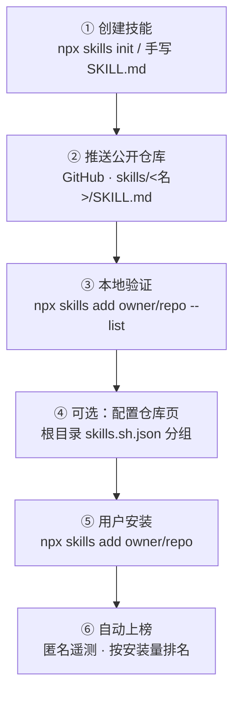

# skills.sh 发布技能指南

> **本次更新（2026-09-20）**：依据官方文档（skills.sh/docs、/docs/cli、/docs/packs、/docs/faq）、`vercel-labs/skills` 仓库 README 及 `skills.sh.json` 官方 Schema 重新校订。
> 相较 2026-08-27 版本，新增：技能发现规则（3 层遍历 + 插件清单）、`skills use/find/update/remove` 命令、来源格式全集、安装范围与方式、环境变量、`skills.sh.json` 权威字段、Packs 细节、兼容性矩阵、故障排查。
> **后续补充**：明确单仓多技能为原生支持（第二节）、`description` 按 invocation 二分写法（第三节）、`mattpocock/skills` 参考实现（第十四节）。

## 一句话结论

**skills.sh 不是"上传技能文件"的网站**：没有网页提交表单，也没有审核队列。它是 Vercel Labs 维护的开放 Agent 技能目录与排行榜（The Open Agent Skills Ecosystem）。技能托管在 GitHub 公开仓库中，"上榜"由 `npx skills` CLI 的**匿名安装遥测**自动触发，**全程无网页上传动作**。

官方 FAQ 原话：

> *"Skills appear on the leaderboard automatically through anonymous telemetry when users run `npx skills add <owner/repo>`."*

因此，所谓"发布"= **把仓库推到公开、确保格式可被 CLI 发现**。剩下的交给用户安装行为。

**发布单位是"仓库"，不是"技能"。** skills 原生支持单仓多技能：一个公开仓库可承载任意数量的技能，CLI 全部发现，用户可按需装单个或装全部，每个技能在榜单上独立计数。这是主流做法（详见第二节模式一）。

---

## 一、发布流程



| 步骤 | 操作 | 说明 |
|---|---|---|
| ① 创建技能 | `npx skills init my-skill` 或手写目录 + `SKILL.md` | frontmatter 必须含 `name` 与 `description`；可选 `scripts/`、`references/`、`templates/` |
| ② 推送公开仓库 | 推到 GitHub **公开**仓库 | 建议放 `skills/<名>/SKILL.md`；私有仓库也可安装，但不进入遥测/排行榜 |
| ③ 本地验证 | `npx skills add owner/repo --list` | 能列出技能 = frontmatter 合法、可被 CLI 发现 |
| ④ 配置仓库页（可选） | 仓库根目录放 `skills.sh.json` | 给多技能仓库分组、排序（见第七节） |
| ⑤ 用户安装 | `npx skills add owner/repo` | **任何人首次安装时 CLI 上报匿名遥测，这是官方认定的"发布"动作** |
| ⑥ 自动上榜 | 网站按安装量排名 | 无提交表单、无审核队列 |

> **关键区分**：`skills.sh` 与 `npx skills` 的关系是"站点 ↔ CLI"。站点只做展示与排名，CLI 才是唯一入口。

---

## 二、仓库与目录结构

### 模式一：一仓库多技能（**原生支持，主流且官方推荐**）

**skills 天然支持单仓多技能发布**：一个仓库可以承载任意数量的技能，CLI 会全部发现，且支持"只装其中一个 / 装全部"的安装粒度。排行榜对每个技能独立计数，同时按仓库聚合展示总量。排行榜上的 `vercel-labs/skills`、`mattpocock/skills`、`microsoft/azure-skills`、`anthropics/skills`、`NVIDIA/skills`（约 379 个技能同仓）均为该结构。

```
owner/skills/               ← 一个公开仓库
├── skills/
│   ├── skill-a/
│   │   ├── SKILL.md
│   │   ├── scripts/        ← 可选：可执行脚本
│   │   ├── references/     ← 可选：按需加载的详细文档
│   │   └── templates/      ← 可选：模板文件
│   ├── skill-b/
│   │   └── SKILL.md
│   └── skill-c/
│       └── SKILL.md
├── skills.sh.json          ← 可选：仓库页分组配置（见第七节）
└── README.md               ← 建议写清有哪些技能、怎么装
```

**支持两级分类目录**（CLI 最多向下遍历 3 层）：

```
skills/<category>/<name>/SKILL.md
skills/<category>/<category>/<name>/SKILL.md
```

例如 NVIDIA 的 `skills/` 下即按领域分子目录组织数百个技能。

#### 单仓多技能：完整可执行示例（以本仓库为例）

本仓库 `github.com/huadongzhou/skills` 采用模式一布局，技能按分类桶组织（`skills/<category>/<name>/`）。当前工作副本 `D:\project\skills` 采用**扁平布局**，技能直接位于 `skills/cognition`、`skills/foundation`——两种布局都能被识别，分类桶并非必需。注意**默认分支是 `master`**：

```bash
# ① 推送公开仓库
git remote add origin git@github.com:huadongzhou/skills.git
git push -u origin master

# ② 验证：应列出 cognition 与 foundation 两个技能
npx skills@latest add huadongzhou/skills --list

# ③ 用户按需安装
npx skills@latest add huadongzhou/skills --skill=cognition    # 只装 cognition
npx skills@latest add huadongzhou/skills --skill=foundation   # 只装 foundation
npx skills@latest add huadongzhou/skills                      # 交互式挑选
```

发布后产生**独立的技能详情页与独立排名**，仓库页另显示总量：

| 层级 | URL / 表现 |
|---|---|
| 仓库页 | `skills.sh/owner/skills`（聚合安装量） |
| 技能页 | `skills.sh/owner/skills/cognition`、`skills.sh/owner/skills/foundation` |

> 也就是说，**单仓多技能不会稀释单个技能的曝光**：每个技能独立竞争榜单，同时共享仓库的整体热度。这也是它成为主流做法的原因。

### 模式二：一技能一仓库

```
owner/caveman/              ← 单技能仓库
├── SKILL.md                ← 根目录直接放
└── README.md
```

适合完全独立、需单独维护版本与受众的技能，如 `juliusbrussee/caveman`、`heygen-com/hyperframes`。

### 技能发现规则（务必理解）

CLI 在仓库中按以下顺序搜索，**每个技能容器目录最多向下遍历 3 层**：

| 类型 | 常见位置 |
|---|---|
| 根目录 | 仓库根若含 `SKILL.md` 即视为技能 |
| 通用容器 | `skills/`、`skills/.curated/`、`skills/.experimental/`、`skills/.system/` |
| Agent 专属 | `.agents/skills/`、`.claude/skills/`、`.codebuddy/skills/`、`.cursor/`、`.codex/` 等 60+ 兼容路径 |

补充规则：

1. **遮蔽（shadowing）**：较浅层级发现的 `SKILL.md` 会遮蔽其下嵌套的同名文件。
2. **兜底**：若标准位置未找到任何技能，CLI 会执行递归搜索。
3. **`--full-depth`**：可发现容器目录之外的 `SKILL.md`（如 `examples/`、`tests/` 下）。
4. **插件清单发现**：若存在 `.claude-plugin/marketplace.json` 或 `.claude-plugin/plugin.json`，其中声明的技能路径**不受 3 层限制**，按声明深度搜索，兼容 Claude Code 插件市场生态。

```json
// .claude-plugin/marketplace.json
{
  "metadata": { "pluginRoot": "./plugins" },
  "plugins": [
    { "name": "my-plugin", "source": "my-plugin", "skills": ["./skills/review", "./skills/test"] }
  ]
}
```

> ⚠️ **本项目注意**：`D:\project\skills` 采用扁平布局，技能位于 `skills/cognition`、`skills/foundation`。仓库根的评测产物（`darwin-*` 系列的 md / html / png / tsv）无 `SKILL.md`，不会被识别为技能，但会随仓库发布，建议移出仓库或加入 `.gitignore`。

---

## 三、SKILL.md 规范

### 必填 frontmatter

| 字段 | 说明 |
|---|---|
| `name` | 唯一标识符（小写，允许连字符）；决定 `skills.sh/owner/repo/<name>` 的 slug |
| `description` | 技能功能与触发场景的简要说明；**写法取决于 invocation 类型，见下方说明** |

#### `description` 的二分写法（易踩坑）

`description` 并非"一律写成触发规则"。应视技能是 **user-invoked** 还是 **model-invoked** 分别处理：

| 类型 | 面向 | 写法 | 示例 |
|---|---|---|---|
| **User-invoked**（仅人类手动调用） | **人类**（浏览斜杠命令时读） | 一句话摘要，**剥掉触发词列表** | `A relentless interview to sharpen a plan or design.` |
| **Model-invoked**（模型可自动触发） | **模型**（用于自动匹配） | **保留丰富触发短语** | `Test-driven development. Use when the user wants to build features or fix bugs test-first, mentions "red-green-refactor"...` |

判定依据：**这个技能是否应该被模型自主调用？** 若是 → model-invoked，触发短语有意义；若只应由人主动发起 → user-invoked，触发短语是噪音。

> 该实践来自 `mattpocock/skills` 仓库的 `.agents/invocation.md`，详见 [mattpocock-skills-仓库研究.md](./mattpocock-skills-仓库研究.md) 第三节。

### 可选 frontmatter

| 字段 | 说明 |
|---|---|
| `metadata.internal` | 设为 `true` 时从常规发现中隐藏，仅 `INSTALL_INTERNAL_SKILLS=1` 时可见可装。适用于开发中或仅供内部工具使用的技能 |
| `allowed-tools` | 声明技能可用的工具白名单（多数 agent 支持） |
| `context: fork` | 仅 Claude Code 支持，在独立上下文执行 |

### 模板

```markdown
---
name: my-skill
description: What this skill does and when to use it
---

# My Skill

Instructions for the agent to follow when this skill is activated.

## When to Use

Describe the scenarios where this skill should be used.

## Steps

1. First, do this
2. Then, do that
```

内部技能示例：

```markdown
---
name: my-internal-skill
description: An internal skill not shown by default
metadata:
  internal: true
---
```

---

## 四、CLI 命令速查

| 命令 | 说明 |
|---|---|
| `npx skills add <source>` | 安装技能 |
| `npx skills use <source>` | 不安装，直接生成提示词 / 启动 agent |
| `npx skills list`（别名 `ls`） | 列出已安装技能 |
| `npx skills find [query]` | 交互式（fzf 风格）或按关键词搜索 |
| `npx skills update [skills]` | 更新已安装技能到最新版本 |
| `npx skills remove [skills]`（别名 `rm`） | 移除已安装技能 |
| `npx skills init [name]` | 创建新的 `SKILL.md` 模板 |

### `skills add` 常用选项

| 选项 | 说明 |
|---|---|
| `-l, --list` | 只列出仓库内技能，不安装 |
| `-s, --skill <name...>` | 按名称安装指定技能（`'*'` 表示全部） |
| `-a, --agent <agent...>` | 指定目标 agent（如 `claude-code`、`codex`；`'*'` 表示全部） |
| `-g, --global` | 安装到用户目录而非项目目录 |
| `--copy` | 复制文件而非符号链接 |
| `-y, --yes` | 跳过确认提示（CI/CD 友好） |
| `--all` | 免提示安装全部技能到全部 agent |

```bash
# 列出仓库技能（发布前自检）
npx skills add owner/skills --list

# 只装其中一个
npx skills add owner/skills --skill cognition

# 名称含空格必须加引号
npx skills add owner/repo --skill "Convex Best Practices"

# 非交互式（CI 场景）
npx skills add owner/skills --skill cognition -g -a claude-code -y

# 不安装，直接喂给 agent
npx skills use owner/skills@cognition | claude
```

### 来源格式（Source Formats）

```bash
npx skills add owner/repo                                          # GitHub 简写
npx skills add https://github.com/owner/repo                       # 完整 URL
npx skills add https://github.com/owner/repo/tree/main/skills/foo  # 仓库内直达路径
npx skills add https://gitlab.com/org/repo                         # GitLab
npx skills add https://dev.azure.com/org/proj/_git/repo            # Azure Repos
npx skills add git@github.com:owner/repo.git                       # 任意 git URL
npx skills add ./my-local-skills                                   # 本地路径
npx skills add https://example.com/download/my-skill               # 直链下载
npx skills add https://skills.sh/p/<pack-id>                       # 技能包
```

**直链下载限制**：默认下载上限 10 MiB，解压内容上限 25 MiB，归档最多 1000 个文件。可用 `SKILLS_DOWNLOAD_MAX_BYTES`、`SKILLS_EXTRACT_MAX_BYTES`、`SKILLS_EXTRACT_MAX_FILES` 覆盖。直链可指向单个 `SKILL.md` 或 `.zip`/`.tar`/`.tar.gz`/`.tgz` 归档（URL 无需含扩展名）。

### 安装范围与安装方式

| 范围 | 标志 | 位置 | 用途 |
|---|---|---|---|
| 项目 | 默认 | `./<agent>/skills/` | 随项目提交，与团队共享 |
| 全局 | `-g` | `~/<agent>/skills/` | 跨所有项目可用 |

交互式安装可选 **Symlink（推荐，单一事实来源、易更新）** 或 **Copy（符号链接不受支持时使用）**。

### 私有仓库

公共与私有仓库命令一致，CLI 复用已配置的 Git 认证（Git credential helper → GitHub CLI → SSH 回退）。可显式设置 `GITHUB_TOKEN` / `GH_TOKEN`。私有仓库可安装，但不进入遥测与排行榜。

---

## 五、上榜与排名（遥测机制）

- 排行榜由 CLI 的**匿名遥测**驱动：安装行为 → 聚合安装量 → 排名。
- 遥测内容：技能名、技能文件、时间戳。**不收集任何个人信息或设备信息**。
- 仓库与技能标识符**仅对 GitHub 明确确认为公开的仓库**发送；其他远程来源类型可能包含来源与技能标识符。
- 站点提供三个榜单：`All Time`、`Trending (24h)`、`Hot`。
- URL 结构：`skills.sh/<owner>/<repo>/<skill-name>`（多技能仓库每个技能有独立详情页并单独计数）；站点来源的技能为 `skills.sh/site/<domain>/<skill>`。

---

## 六、环境变量

| 变量 | 说明 |
|---|---|
| `DISABLE_TELEMETRY=1` | 禁用匿名遥测 |
| `DO_NOT_TRACK=1` | 禁用遥测的替代方式 |
| `INSTALL_INTERNAL_SKILLS=1` | 显示并安装 `metadata.internal: true` 的技能 |
| `GITHUB_TOKEN` / `GH_TOKEN` | GitHub API 访问的显式令牌（私有仓库下载、更新检查、tree 查询） |

```bash
INSTALL_INTERNAL_SKILLS=1 npx skills add owner/skills --list
```

---

## 七、仓库页配置：`skills.sh.json`

放在**仓库根目录**，用于自定义仓库在 skills.sh 上的页面分组与排序。官方 Schema：`https://skills.sh/schemas/skills.sh.schema.json`。

| 字段 | 类型 | 必填 | 说明 |
|---|---|---|---|
| `$schema` | string(uri) | 否 | 编辑器自动补全与校验（推荐；旧字段 `schema` 已不推荐） |
| `notGrouped` | `"top"` \| `"bottom"` | 否 | 未列入任何分组的技能放在哪里，默认 `bottom` |
| `groupings` | array | **是** | 分组列表，1~50 项 |
| `groupings[].title` | string | **是** | 分组标题，1~120 字符 |
| `groupings[].description` | string | 否 | 一句话说明，≤500 字符 |
| `groupings[].skills` | string[] | **是** | 该分组下的技能名或 slug，1~500 项 |

```json
{
  "$schema": "https://skills.sh/schemas/skills.sh.schema.json",
  "notGrouped": "bottom",
  "groupings": [
    {
      "title": "Knowledge & Docs",
      "description": "构建深度知识文档与项目上下文基建。",
      "skills": ["cognition", "foundation"]
    }
  ]
}
```

---

## 八、技能包（Packs）

Packs 是**不公开列出**的技能集合，一条命令即可安装；可混合公共技能、私有文件/文件夹/zip，以及你已授权访问的 GitHub 仓库技能。

### 创建

需使用 Vercel 账号登录（这是唯一需要登录的环节）：

1. 打开 [skills.sh/packs/create](https://skills.sh/packs/create) 并以 Vercel 登录
2. 填写名称，可选简短描述
3. 选择要共享该 pack 的 Vercel team
4. 添加任意组合的公共技能、私有文件、已连接的 GitHub 仓库技能
5. 创建后复制安装命令

### 安装与更新

```bash
npx skills add https://skills.sh/p/<pack-id>   # 安装，无需登录
npx skills update                              # 更新全部（仅重新下载有变化的技能）
npx skills update <skill>                      # 更新单个技能
```

新安装总是拉取当前内容，因此更新后再次执行安装命令即得到最新技能。

### 限制与隐私

- 每个技能需含带 `name`、`description` 的 `SKILL.md`；构建器会跳过非法技能文件与二进制文件、单个文件 >2 MB 的内容。
- Packs 是**未列出但非访问控制**：任何拿到 URL 的人都能查看并安装。**不要放入密钥或凭据**；需要让链接失效时，在 pack 页面删除该 pack。

---

## 九、README 徽章

```markdown
[](https://skills.sh/owner/repo)
```

替换 `owner/repo` 为你的 GitHub 来源即可展示安装量徽章。

---

## 十、兼容性

技能遵循共享的 [Agent Skills 规范](https://agentskills.io)，基础技能跨 agent 通用；部分高级特性为特定 agent 专属。

| 特性 | 支持情况 |
|---|---|
| 基础技能 | 全部主流 agent（Claude Code、Cursor、CodeBuddy、Codex、OpenCode、Cline、Copilot、Roo Code、Kiro CLI、Amp、Qoder 等 18+） |
| `allowed-tools` | 多数支持（Kiro CLI、Zencoder 不支持） |
| `context: fork` | 仅 Claude Code |
| Hooks | Claude Code、Cline、Kiro CLI |

---

## 十一、常见坑

1. **CLI 能装 ≠ 网站有显示**：网站走独立的 blob 缓存，push 后可能显示 0 个技能。此时到 [vercel-labs/skills/issues](https://github.com/vercel-labs/skills/issues) 提 issue 请求索引（标题如 `Listing: Request indexing for owner/repo`，附仓库地址与技能清单），官方触发后通常 1~3 天可见。
2. **更新技能**：改完 push 后，在临时目录再跑一次 `npx skills add owner/repo --yes` 触发新遥测，网站约 12~24 小时聚合刷新；**改名更慢**（名称从首次遥测缓存，需重新索引）。
3. **`name` 决定 URL**：slug 一旦被遥测缓存，改名会导致详情页 URL 变更，尽量早定名。
4. **描述建议英文**：面向国际受众，且会被用作路由触发规则。
5. **仓库必须公开才进榜**：私有仓库可安装，但遥测/排行榜只覆盖 GitHub 确认公开的仓库。
6. **安全**：站点会例行安全审计，但**不保证**每个技能的安全性或质量。安装含 `scripts/` 的技能前请自行审查；漏洞上报至 security.vercel.com。
7. **eval 产物别混入 `skills/`**：`report.html`、`benchmark.json` 等评测输出会随仓库发布，建议移出或 gitignore。
8. **不要提交密钥**：尤其 Packs 是"未列出但任何人可访问"。

---

## 十二、故障排查

| 现象 | 解决方法 |
|---|---|
| `No skills found` | 确认仓库含有效 `SKILL.md`，且 frontmatter 同时包含 `name` 与 `description`（YAML 合法） |
| 技能在 agent 中未加载 | 核对安装路径；确认 frontmatter YAML 有效；查阅对应 agent 的技能加载要求 |
| 权限错误 | 确认对目标目录有写权限 |
| 网站不显示技能 | 见"常见坑"第 1、2 条（缓存 + 索引请求） |

---

## 十三、决策建议

| 场景 | 建议 |
|---|---|
| **默认选择**（多技能，无论主题是否相近） | 单仓多技能：放进一个仓库的 `skills/` 目录（**推荐**，省事、可分组、各技能独立排名且共享仓库热度） |
| 技能彼此独立、需单独维护版本/受众，或希望仓库页只呈现单一技能 | 一技能一仓库 |
| 想分享含私有/内部技能的合集 | 用 Packs（需 Vercel 登录，未列出但任何人凭 URL 可装） |
| 多技能仓库需要页面分组 | 加根目录 `skills.sh.json` |
| 技能仍在开发中、暂不公开 | `metadata.internal: true` 隐藏，配合 `INSTALL_INTERNAL_SKILLS=1` 自测 |

---

## 十四、参考实现：`mattpocock/skills`

多技能单仓的标杆案例（仓库总量 4.1M 安装，10+ 技能各自进榜）。完整拆解见 **[mattpocock-skills-仓库研究.md](./mattpocock-skills-仓库研究.md)**。

其做法可归纳为 7 条机制，按移植优先级：

| 优先级 | 机制 | 要点 |
|---|---|---|
| P0 | **分桶 + 推广闸门** | 5 个桶（engineering / productivity / in-progress / misc / deprecated）决定技能是否进插件、README、docs 页 |
| P0 | **invocation 二分** | 每个技能声明 user-invoked 或 model-invoked；不变量：user-invoked 可调用 model-invoked，**绝不可调用另一个 user-invoked** |
| P0 | **description 分写** | 见第三节（人类摘要 vs 模型触发词） |
| P1 | **changesets + CI** | `private` 包借 changesets 管版本；push main 自动开 version PR |
| P1 | **双写点同步脚本** | `sync-plugin-version.mjs` 保证 `package.json` ↔ `plugin.json` 版本一致，带 `--check` |
| P2 | **`AGENTS.md` → `CLAUDE.md` 符号链接** | 一个软链让 Codex 与 Claude Code 读同一份规则，零漂移 |
| P2 | **安装命令 canonical block** | 安装文案先写进单一来源文档，再向 README/docs/changeset 传播 |

**两点值得注意**：

- 该仓库**没有** `skills.sh.json`：可发现性靠标准目录结构 + `.claude-plugin/plugin.json` 的显式 `skills[]`（走插件清单发现路径）。这印证了 `skills.sh.json` 属可选优化，非发布必需品。
- 其三清单同步（README / plugin.json / docs）**没有自动化脚本**，靠 `CLAUDE.md` 写死规则让代理自行遵守。技能数少时属过度设计，**技能超过 5 个再引入更合适**。

---

## 附：权威来源

| 内容 | 链接 |
|---|---|
| 技能目录与排行榜 | https://www.skills.sh |
| 官方文档 | https://www.skills.sh/docs |
| CLI 参考 | https://www.skills.sh/docs/cli |
| Packs 文档 | https://www.skills.sh/docs/packs |
| FAQ（含上榜机制） | https://www.skills.sh/docs/faq |
| CLI 开源仓库 | https://github.com/vercel-labs/skills |
| 仓库页配置 Schema | https://skills.sh/schemas/skills.sh.schema.json |
| Agent Skills 规范 | https://agentskills.io |
| 多技能管理参考实现 | https://github.com/mattpocock/skills |
